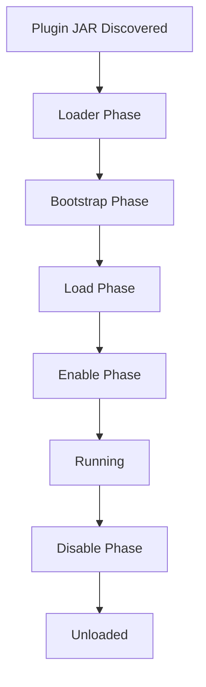

Paper plugins go through several distinct phases during their lifecycle. Understanding these phases is crucial for proper plugin initialization and cleanup.

## Lifecycle Phases

The plugin lifecycle consists of three main phases, plus optional bootstrapping and loading phases:



## Loader Phase (Optional)

The loader phase occurs before the plugin class is instantiated and runs in a separate classloader.

### PluginLoader Interface

Implement `io.papermc.paper.plugin.loader.PluginLoader` to configure your plugin's classpath:

```java
package com.example.myplugin;

import io.papermc.paper.plugin.loader.PluginClasspathBuilder;
import io.papermc.paper.plugin.loader.PluginLoader;
import org.jetbrains.annotations.NotNull;

public class MyPluginLoader implements PluginLoader {
    @Override
    public void classloader(@NotNull PluginClasspathBuilder classpathBuilder) {
        // Add runtime dependencies to the classpath
        // This is useful for loading external libraries
    }
}
```

Register in `paper-plugin.yml`:

```yaml
loader: com.example.myplugin.MyPluginLoader
```

<Warning>
  Static values set in the loader class will not persist when the plugin loads due to different classloaders.
</Warning>

## Bootstrap Phase (Optional)

The bootstrap phase runs before the server is fully loaded, allowing early initialization.

### PluginBootstrap Interface

Implement `io.papermc.paper.plugin.bootstrap.PluginBootstrap` for early setup:

```java
package com.example.myplugin;

import io.papermc.paper.plugin.bootstrap.BootstrapContext;
import io.papermc.paper.plugin.bootstrap.PluginBootstrap;
import org.jetbrains.annotations.NotNull;

public class MyPluginBootstrap implements PluginBootstrap {

    @Override
    public void bootstrap(@NotNull BootstrapContext context) {
        // Perform early initialization
        // Access logger: context.getLogger()
        // Access plugin directory: context.getDataDirectory()
        
        context.getLogger().info("Bootstrapping plugin...");
    }
}
```

Register in `paper-plugin.yml`:

```yaml
bootstrapper: com.example.myplugin.MyPluginBootstrap
```

<Note>
  The bootstrap phase is experimental. Only call API methods explicitly documented to work during bootstrap. Most Bukkit API calls will throw exceptions or return null.
</Note>

### Custom Plugin Instantiation

You can override how your plugin is created:

```java
public class MyPluginBootstrap implements PluginBootstrap {

    @Override
    public void bootstrap(@NotNull BootstrapContext context) {
        // Bootstrap logic
    }

    @Override
    public JavaPlugin createPlugin(PluginProviderContext context) {
        // Custom plugin instantiation logic
        // For example, passing constructor arguments
        return new MyPlugin(someConfig);
    }
}
```

## Load Phase

The load phase occurs when your plugin is loaded but before it's enabled.

### onLoad() Method

Override the `onLoad()` method in your `JavaPlugin` class:

```java
public class MyPlugin extends JavaPlugin {

    @Override
    public void onLoad() {
        // Plugin is loaded but not yet enabled
        // Good for:
        // - Registering custom world generators
        // - Setting up configuration
        // - Initializing data structures
        
        getLogger().info("Plugin loaded");
    }
}
```

<Tip>
  Use `onLoad()` for initialization that needs to happen before the server finishes starting up, such as registering world generators.
</Tip>

### Load Order

Control when your plugin loads with the `load` field in `paper-plugin.yml`:

```yaml
load: STARTUP  # or POSTWORLD (default)
```

- `STARTUP` - Loads during server startup, before worlds
- `POSTWORLD` - Loads after worlds are loaded

## Enable Phase

The enable phase is when your plugin becomes active and starts functioning.

### onEnable() Method

This is the main entry point for your plugin:

```java
public class MyPlugin extends JavaPlugin {

    @Override
    public void onEnable() {
        // Plugin is now enabled
        // Good for:
        // - Registering event listeners
        // - Registering commands
        // - Starting tasks/schedulers
        // - Connecting to databases
        // - Loading configuration
        
        getLogger().info("Plugin enabled");
        
        // Register events
        getServer().getPluginManager().registerEvents(new MyListener(), this);
        
        // Register commands
        registerCommand("mycommand", new MyCommand());
        
        // Load config
        saveDefaultConfig();
    }
}
```

### Lifecycle Event Registration

During `onEnable()`, you can register lifecycle event handlers:

```java
@Override
public void onEnable() {
    getLifecycleManager().registerEventHandler(LifecycleEvents.COMMANDS, event -> {
        // Command registration logic
        event.registrar().register("mycommand", "Description", 
            Collections.emptyList(), new MyBasicCommand());
    });
}
```

<Warning>
  For Paper plugins (not legacy Bukkit plugins), you cannot use `getCommand()` during `onEnable()`. Use `registerCommand()` instead or register via lifecycle events.
</Warning>

## Running Phase

Once enabled, your plugin is fully active and responds to events, commands, and scheduled tasks.

### Checking if Enabled

You can check if your plugin is currently enabled:

```java
if (isEnabled()) {
    // Plugin is running
}
```

### Internal State

The `JavaPlugin` class tracks its state:

```java
private boolean isEnabled = false;  // Set to true during onEnable()
```

From `JavaPlugin.java:272-288`:

```java
public final void setEnabled(final boolean enabled) {
    if (isEnabled != enabled) {
        isEnabled = enabled;

        if (isEnabled) {
            this.isBeingEnabled = true;
            try {
                onEnable();
            } finally {
                this.allowsLifecycleRegistration = false;
                this.isBeingEnabled = false;
            }
        } else {
            onDisable();
        }
    }
}
```

## Disable Phase

The disable phase occurs when the plugin is being shut down.

### onDisable() Method

Clean up resources when your plugin is disabled:

```java
public class MyPlugin extends JavaPlugin {

    @Override
    public void onDisable() {
        // Plugin is being disabled
        // Good for:
        // - Saving data
        // - Closing database connections
        // - Canceling tasks
        // - Cleaning up resources
        
        getLogger().info("Plugin disabled");
        
        // Save data
        saveConfig();
        
        // Close connections
        if (database != null) {
            database.close();
        }
    }
}
```

<Note>
  Always implement `onDisable()` to ensure proper cleanup. This prevents resource leaks and data loss.
</Note>

## Complete Lifecycle Example

```java
package com.example.myplugin;

import org.bukkit.plugin.java.JavaPlugin;

public final class MyPlugin extends JavaPlugin {

    @Override
    public void onLoad() {
        getLogger().info("[Load] Initializing data structures...");
        // Early initialization
    }

    @Override
    public void onEnable() {
        getLogger().info("[Enable] Starting plugin...");
        
        // Load configuration
        saveDefaultConfig();
        
        // Register listeners
        getServer().getPluginManager().registerEvents(new MyListener(), this);
        
        // Register commands
        registerCommand("mycommand", new MyCommand());
        
        getLogger().info("[Enable] Plugin enabled successfully!");
    }

    @Override
    public void onDisable() {
        getLogger().info("[Disable] Shutting down plugin...");
        
        // Save data
        saveConfig();
        
        getLogger().info("[Disable] Plugin disabled successfully!");
    }
}
```

## Key Lifecycle Methods Summary

| Method | When Called | Purpose |
|--------|-------------|----------|
| `classloader()` | Before plugin loads (separate classloader) | Configure runtime classpath |
| `bootstrap()` | Before server loads | Early initialization |
| `onLoad()` | Plugin loaded, not enabled | Setup before enable |
| `onEnable()` | Plugin is being enabled | Main initialization |
| `onDisable()` | Plugin is being disabled | Cleanup and save data |

## Best Practices

1. **Use the right phase**: Don't do heavy initialization in `onLoad()` that belongs in `onEnable()`
2. **Always implement onDisable()**: Clean up resources to prevent memory leaks
3. **Don't block the main thread**: Keep lifecycle methods fast
4. **Handle errors gracefully**: Catch exceptions in lifecycle methods to prevent plugin load failures
5. **Log lifecycle events**: Help with debugging by logging what's happening
